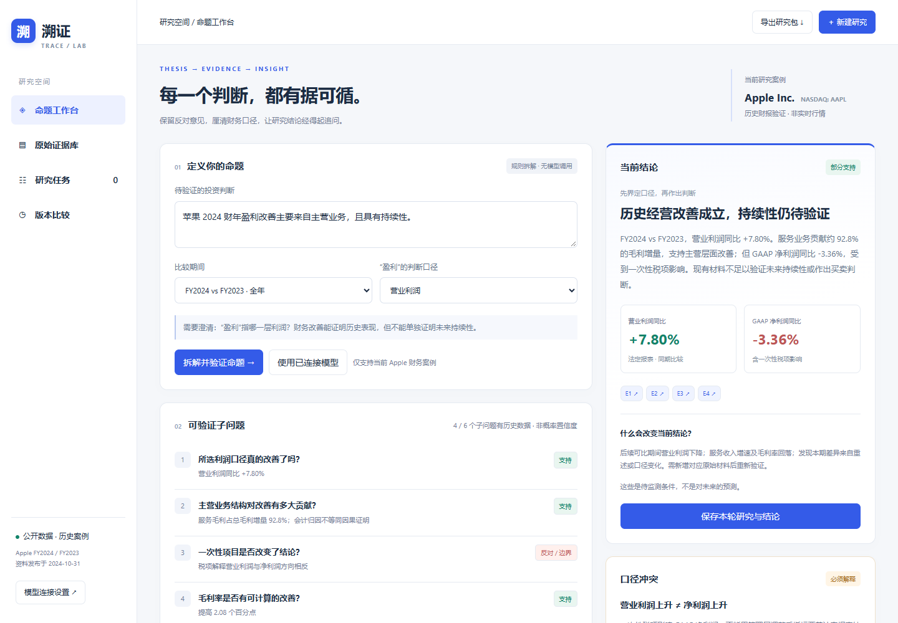

# 溯证 · TRACE LAB

把“盈利改善来自主营业务”的投资假设转化为可验证子问题、真实财报证据、反对意见和资料缺口。

- 产品地址：https://mountttains.github.io/evidence-chain-lab/
- 源代码：https://github.com/mountttains/evidence-chain-lab
- 演示视频：仓库 `demo/演示视频.mp4`（同时放入提交压缩包）
- 数据案例：Apple FY2024 / FY2023，以及同期第四季度。**历史资料，不是实时行情。**



## v1.1：可持续使用的研究工作流

- 三个快捷命题案例；修改输入后明确标出旧结论，避免新旧口径混淆。
- 草稿自动保存、刷新恢复；已保存研究版本可继续研究，并恢复当时的证据备注。
- 净利润变动图：营业利润 +89.15 亿、其他税前损益 +8.34 亿、所得税影响 −130.08 亿，合计 −32.59 亿美元。该图为报表恒等式拆分，不将税项总变动误当成一次性税项。
- 证据搜索、分类计数、研究者备注；备注与原始披露区分，按期间、指标和证据编号隔离。
- 下载可阅读的 Markdown 报告，或导出完整 JSON；支持导入 v1/v2 研究包，先核对数据，再重新计算结论。
- 任务去重、删除撤销；导入重复记录保留本地版本，不静默丢弃超额记录。
- 模型请求可取消；切换命题或连接后取消旧请求，失败重试不保留旧 AI 输出。

导入上限 2 MB、200 个任务、50 个版本。已有数据快照不同的包会被拒绝；不会把外部包中的结论文字直接当成验证结果。默认仍为规则路径，不需要模型凭证。

## 适合谁，解决什么问题

面向需要核对盈利质量的投研人员。系统不把一句笼统判断直接变成投资建议，而是要求先澄清“盈利”口径，再保留支持、反对与无法验证的材料。

当前收敛到一个有完整公开原文的真实案例，不宣称支持所有上市公司或所有投资命题。

## 使用方式

1. 打开产品，输入包含“苹果 / Apple”的盈利改善命题。
2. 选择全年或第四季度，以及营业利润、GAAP 净利润或毛利润口径。
3. 点击“拆解并验证命题”，查看六个子问题和三类证据。
4. 点击证据卡，查看财报字段、计算方法、页码和发行人原始 PDF。
5. 切换净利润口径，观察结论反转；通过“修订为营业利润口径”处理歧义。
6. 保存两轮研究，在“版本比较”中查看口径和结论差异。
7. 追问未知问题并保存为研究任务，完成状态在浏览器本地保留。
8. 导出 JSON 研究包，包含原始数值、引用、结论、研究版本和任务。
9. 页面底部可演示接口异常，并重试恢复。

草稿、证据备注、版本和任务在当前浏览器保存，不跨设备同步。API Key 只存在当前页面内存，不进入本地存储或导出；刷新后清除。不要录入敏感个人或投资组合信息。

## 本地运行

运行环境：Node.js 20+，现代 Chrome / Edge。

```sh
npm start
# 打开 http://127.0.0.1:4173
npm test
```

界面无需安装依赖。直接打开 index.html 也可使用内置快照，但“重新载入数据”的 HTTP 行为需本地服务器或部署站点。

浏览器验证：

```sh
npm install
npx playwright install chrome
npm run test:browser
```

测试脚本默认使用 Chrome，可通过 TEST_URL 指定部署站点。浏览器测试覆盖模型请求时使用模拟响应，**不表示真实模型推理已经测试成功**。

## 数据与可追溯设计

原始来源：
- [Apple 官方财务报表 PDF](https://www.apple.com/newsroom/pdfs/fy2024-q4/FY24_Q4_Consolidated_Financial_Statements.pdf)：第 1 页损益表、第 3 页现金流、第 4 页 GAAP / Non-GAAP 调节。资料为业绩发布附表，标注 Unaudited，不称为审计报告。
- [Apple 官方业绩新闻稿](https://www.apple.com/newsroom/2024/10/apple-reports-fourth-quarter-results/)：发布于 2024-10-31。

核验日：2026-10-09。单位：百万美元。全年与第四季度严格分开。上述材料均来自同一发行人，**不算独立信源交叉验证**。

`data/case.json` 为从官方 PDF 转录并核对的结构化快照。`data/case.js` 为同一数据的浏览器启动副本。`data/provenance.json` 保存原始文件 SHA-256、抓取时间、页数和关键字段的自动核对结果。页面的重新载入动作请求本站快照，不伪称拉取实时交易数据。

```sh
pip install pypdf
python scripts/verify_sources.py
```

脚本从发行人下载 PDF（已有下载则复用），验证营业利润、净利润、毛利和税项。其他数值经过人工对照。原始 PDF 不随提交包重复分发；证据卡提供发行人链接及页码。

关键事实：
- 全年营业利润：123,216 / 114,301，同比 +7.80%。
- 全年净利润：93,736 / 96,995，同比 −3.36%。
- 服务毛利增量：(96,169−25,119)−(85,200−24,855) = 10,705。
- 总毛利增量：180,683−169,148 = 11,535；服务贡献约 92.8%。
- 综合毛利率提升约 2.08 个百分点。
- 一次性所得税调整：10,246。调整后数据不替代 GAAP。

## AI 角色与边界

产品提供两个清楚区分的路径：

- **默认规则验证**：不调用模型。子问题来自披露的财务研究模板；数字、分类和结论由可测试函数生成。
- **可选模型辅助**：在“模型连接设置”中填写兼容 Chat Completions 的完整接口、模型 ID 和自己的 API Key。接口须允许该站点的浏览器 CORS 请求，远程地址必须 HTTPS。用户明确同意后才发送命题和公开证据。模型返回补充问题、解释和引用；程序校验 JSON 结构与引用 ID，不覆盖确定性财务结论。

模型提示词及真实请求逻辑见 `app.js`。没有内置或共享密钥，没有部署后端代管凭证。由于未提供真实模型 API 凭证，交付时完成了模拟服务的成功、401、虚构引用、取消/过期响应及失败重试清理测试；**真实模型端到端推理尚未验证**。格式和引用存在性验证不等于模型语义正确。

该设计优先避免 AI 编造财务数字；也意味着当前版本并非通用自动投研系统。

## 设计取舍

- 可追溯优先于貌似精确的概率：不展示没有校准依据的“78% 置信度”，改为明确 4/6 问题有历史数据。
- 冲突按口径解释：营业利润上升和净利润下降同时保留，不投票抹平。
- 事实与推断分开：服务毛利贡献是会计拆分，不等于销量、价格、汇率的因果解释。
- 未知保留为未知：未来持续性和独立交叉验证列为研究任务，不自动支持原命题。
- 网络失败保留已核验快照，并显示错误和重试操作，不补造数据。
- 原始材料被视为数据，不被视为系统指令；模型输出按文本转义展示。

## 未做事项

未接入扶摇/iFinD、实时 A 股行情、任意公司检索、登录/云端数据库、多人协作、生产级密钥代理、自动财报增量采集及独立渠道资料。规则模板限于正向盈利改善假设，不判断自定义数值目标；相反结果体现为反对证据。估值、股价、产业链和未来年份等超出本案例范围的输入不应被当作已验证结论。

无个性化买卖建议、目标价或收益保证。历史案例不能外推当前投资结论。

## 项目结构

```text
index.html / styles.css    产品界面
app.js                    交互、持久化、导出、可选模型调用
engine.js                 财务计算、证据归类、输入与模型校验
workspace.js              研究状态恢复、导入校验、合并与报告生成
data/                     真实公开快照与来源核验记录
scripts/                  本地服务、来源核验与演示录制
tests/                    核心单测、浏览器流程测试
demo/                     60–180 秒字幕演示视频
AI使用与验证记录.md         开发与产品中的 AI 使用边界
测试说明.md                实测结果和未测事项
```

部署使用 GitHub Pages 的 main 分支根目录。无需构建步骤、服务器或公开密钥。
